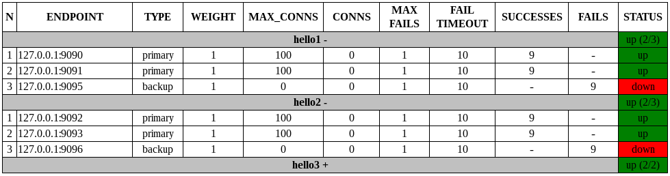

# Nginx with healthchecks
This configuration contains modules to support healthchecks (http and stream) in opensource nginx version.

Table of Contents
=================

* [Dependencies](#dependencies)
* [Install](#install)
* [UI](#ui)

Dependencies
============

This module has several dependencies:
* [lua-nginx-module](https://github.com/openresty/lua-nginx-module)
* [ngx_devel_kit](https://github.com/simpl/ngx_devel_kit)
* [ngx_dynamic_upstream](https://github.com/ZigzagAK/ngx_dynamic_upstream)
* [ngx_dynamic_upstream_lua](https://github.com/ZigzagAK/ngx_dynamic_upstream_lua)
* [ngx_dynamic_healthcheck](https://github.com/ZigzagAK/ngx_dynamic_healthcheck)
* [stream-lua-nginx-module](https://github.com/openresty/stream-lua-nginx-module)
* [lua-cjson](https://github.com/openresty/lua-cjson)
* [lua-resty-lock](https://github.com/openresty/lua-resty-lock)
* [lua-resty-core](https://github.com/openresty/lua-resty-core)

Install
=======

Build nginx with healthchecks.
All dependencies are downloaded automaticaly.

Pre requirenments (for example centos/redhat)

```
sudo yum install gcc-c++.x86_64 zlib-devel openssl-devel
```

Build

```
git clone git@github.com:ZigzagAK/nginx-resty-auto-healthcheck-config.git
cd nginx-resty-auto-healthcheck-config
./build.sh
```

Archive will be placed in the `install` folder after successful build.

UI
==
UI displays upstream status.
Available on `http://127.0.0.1:8181/status/http` for http upstreams and `http://127.0.0.1:8181/status/stream` for stream upstreams.



[Back to TOC](#table-of-contents)